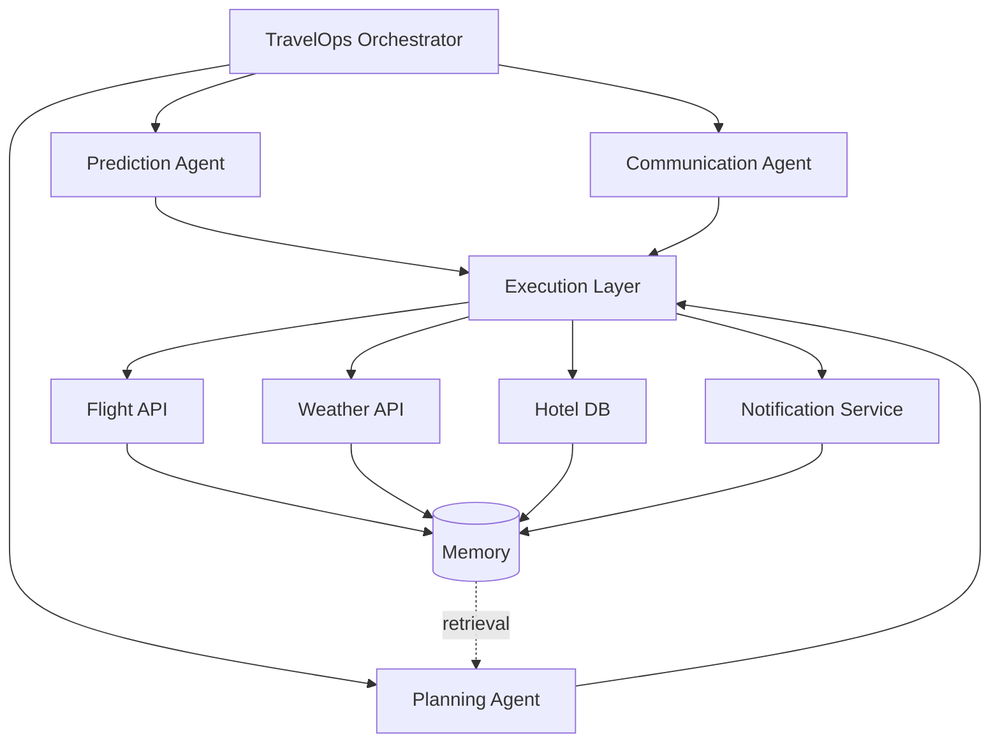

# 1. System Architecture

## The misconception to avoid

The default thing people build is not an autonomous system:

```
User  →  LLM  →  Answer
```

That is a chatbot. It has no goals, no tools, no memory of outcomes, and nothing happens in the
world as a result of it running.

## What TravelOps AI is instead

```
                 TravelOps Orchestrator
                          │
        ┌─────────────────┼──────────────────┐
        │                 │                  │
   Prediction         Planning         Communication
     Agent             Agent               Agent
        │                 │                  │
        ├──────────── Execution Layer ───────┤
        │        │            │              │
   Flight API  Weather     Hotel DB     Notification
        │        │            │              │
        └──────────────── Memory ────────────┘
```

Same thing as a rendered diagram:



## The two load-bearing ideas

**The orchestrator is the brain, not the LLM.** The LLM is one component among many. It is invoked
at specific points for specific reasoning tasks. It does not sit in the middle of the system.

**Most nodes are deterministic.** Weather lookup, hotel search, notification dispatch, compensation
maths, and policy validation are ordinary code. Only planning, explanation, and message generation
need a model. See [`06-ai-vs-deterministic.md`](06-ai-vs-deterministic.md) for the full split.

## Preferred framing: a workflow engine, not a swarm

If this were being built as a product rather than a hackathon demo, the right first abstraction is
**not** "many agents". It is a **workflow engine where each step is a node with clear inputs and
outputs**.

- Some nodes use an LLM — Planner, Explainer, Report Generator.
- Most nodes are deterministic services — weather lookup, hotel search, notification dispatch,
  policy validation.

This scales better than a collection of agents chatting with each other, and it is significantly
easier to debug, test, and demonstrate. "Agent" then becomes a naming convention for a node with a
goal and tools, rather than an architectural commitment to autonomous chat.

## Layers

| Layer | Responsibility | LLM involved? |
| --- | --- | --- |
| Ingest | Pull raw signals: weather, flight status, schedules | No |
| Prediction | Turn signals into a risk estimate (delay probability) | No — rules engine |
| Event bus | Emit and route typed events between stages — **Redis Streams** | No |
| Orchestrator | Own workflow state, sequencing, recursion limits, timeouts | No |
| Planning | Produce a structured recovery plan | Yes |
| Execution | Carry out individual tasks against real systems | No |
| Communication | Draft and dispatch passenger messaging | Optional (wording only) |
| Memory | Store incidents, plans, costs, outcomes; serve retrieval | No |
| Explainability | Justify a chosen plan to a human | Yes |
