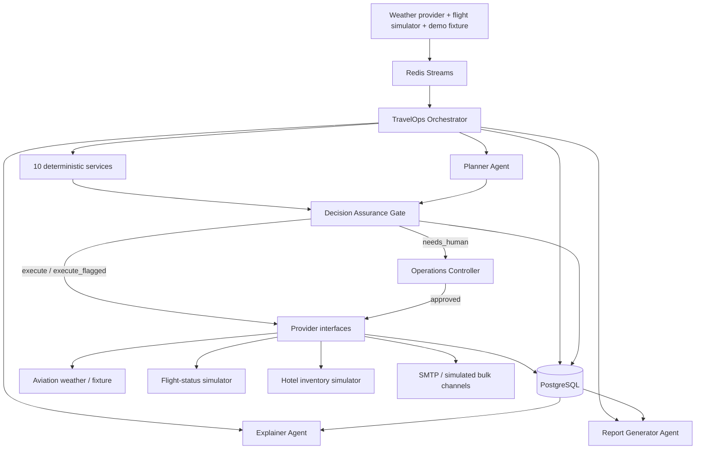

# 1. System Architecture

## Product boundary

TravelOps AI is not `User → LLM → answer`. It is a typed workflow engine with a deterministic control
plane. A model may propose and explain; it cannot authorise or execute.



## Component taxonomy

### 1 orchestrator

Owns incident state, task ordering, dependency resolution, retries, idempotency, timeout/iteration caps,
human approvals and audit correlation. It contains no open-ended language reasoning.

### 3 reasoning agents

| Agent | Purpose | Prohibited |
| --- | --- | --- |
| Planner | Proposes ordered recovery tasks from typed context and precedent | Direct execution; unknown action types |
| Explainer | Converts structured evidence/decisions into operator-readable explanation | Changing a decision or inventing a citation |
| Report Generator | Produces the incident summary from immutable records | Creating metrics not present in records |

### 10 deterministic services

Delay Risk, Flight Recovery, Hotel, Transport, Communication, Compensation, Crew Impact, Connection,
Gate/Resource, Analytics/Learning. They are typed code and provider calls, not agents.

## Execution boundary

```text
Model proposal
  → schema + action-enum validation
  → entity resolution
  → Decision Assurance Gate
  → execute / execute_flagged / needs_human
  → immutable action + evidence record
```

The gate checks evidence completeness, source freshness, entity validity, policy compliance, conflicts
and action risk. LLM self-reported confidence is never used for control flow.

## Layers

| Layer | Responsibility | Model? |
| --- | --- | --- |
| Providers | Real/simulated weather, schedules, flight status, notifications | No |
| Ingest/events | Normalize signals and emit typed events | No |
| Delay Risk service | Deterministic risk index/level and contributing factors | No |
| Orchestrator | Workflow state and safety limits | No |
| Reasoning agents | Plan, explain, report through typed contracts | Yes |
| Assurance | Deterministic action authorisation | No |
| Services | Search, calculate, validate, write and dispatch | No |
| Policy | Resolve reviewed packs and evaluate rules | No |
| Memory | Store incidents/outcomes and retrieve precedent with SQL | No |
| UI | Operations control surface, approvals, replay, provenance | No |

## Provider strategy

Every external dependency implements the same provider protocol in `live` and `fixture`/`simulated`
forms. No vendor API sits on the only path to a checkpoint demonstration.

| Capability | Demo provider | Production adapter later |
| --- | --- | --- |
| Weather | AWC live + committed fixture | Airline-approved weather feed |
| Flight status | Deterministic simulator | Airline operations/flight-status feed |
| Reaccommodation | Simulated inventory write | PSS/GDS/NDC integration |
| Hotels/transport | Synthetic inventory + simulated reservation | Contracted accommodation/ground providers |
| Notifications | Allowlisted SMTP + simulated bulk records | Airline communications platform |
| LLM | Groq live + recorded fixture + off | Approved enterprise inference gateway |

## Regulatory boundary

```text
Trip Context → Jurisdiction Resolver → approved versioned Policy Pack
             → deterministic Rule Engine → Assurance Gate → cited result
```

Retrieval displays the source clause and grounds explanations. It never selects the law or calculates an
amount. Pack status controls what may be claimed: `demo` is a fictional fixture, `charter` produces real
cited figures behind a dated-source badge, and `verified` requires the current primary regulation plus SME
sign-off. See [`19-jurisdiction-and-policy-packs.md`](19-jurisdiction-and-policy-packs.md).

## Deployment baseline

Local Docker Compose:

- React static/dev server
- FastAPI/Uvicorn
- PostgreSQL
- Redis

No Kubernetes, Kafka, RabbitMQ or graph database. Those would add failure modes without increasing the
prototype's proof value.

## Non-functional architecture decisions

- UTC storage; explicit local timezone in display.
- Idempotency key on every mutation.
- Correlation and incident IDs on every event/log.
- Immutable assurance and policy evaluation records with config/pack hashes.
- Provider provenance in every data response.
- Fixed-seed fixture and one-command reset.
- `LLM_MODE=off` remains a supported operating mode, not a demo hack.
