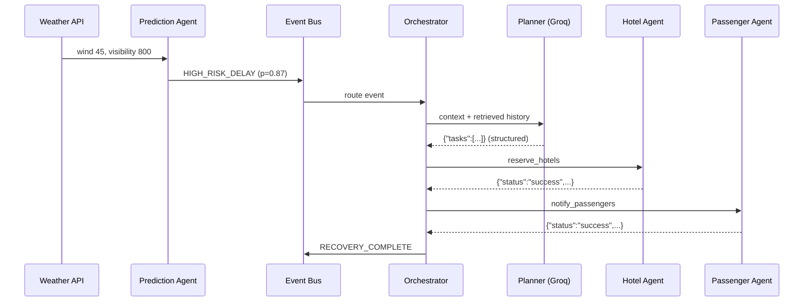

# 2. End-to-End Disruption Flow

A worked example. A storm begins over Bengaluru.

## Step 1 — Raw signal

The weather API reports:

```
Rain
Wind        45 km/h
Visibility  800 m
```

No AI at this stage. This is just data.

## Step 2 — Prediction Agent

Input:

```json
{
  "airport": "BLR",
  "wind": 45,
  "visibility": 800
}
```

Output — an estimated delay probability:

```
87%
```

In the MVP this is a **simple ML model or a rule engine**. No LLM needed. This matters: prediction
must be fast, cheap, and reproducible, and none of those are LLM strengths.

## Step 3 — Event generated

```
HIGH_RISK_DELAY
```

This event triggers the orchestrator. Prediction does not call the planner directly — it emits.

## Step 4 — Planner Agent (Groq)

Prompt, roughly:

```
Flight AI203 delayed 2 hours.

Passengers:   180
Connections:  47
Hotels:       3 nearby

Generate a recovery plan.
```

Groq returns **structured JSON**:

```json
{
  "tasks": [
    "notify_passengers",
    "check_connections",
    "reserve_hotels",
    "reassign_gate"
  ]
}
```

> **Rule:** never let the LLM return free-form text for execution. Always structured output.

## Step 5 — Execution

Each task is dispatched to the agent that owns it.

**Hotel Agent** receives `reserve_hotels`:

```
Hotel database  →  availability  →  book
```

No LLM required.

**Passenger Agent** produces:

```
SMS
Email
Push notification
```

The LLM may help personalise the wording, but the **workflow must not depend on it**. If the model
is unavailable, templated messages still go out.

## Flow summary



## Agent communication: events, not direct calls

Agents must **not** call each other directly.

```
Prediction  →  event  →  Planner  →  event  →  Execution  →  event  →  Notification
```

Loose coupling is what makes the system extensible. Adding a Rebooking Agent should mean
subscribing to an existing event, not editing the planner.
