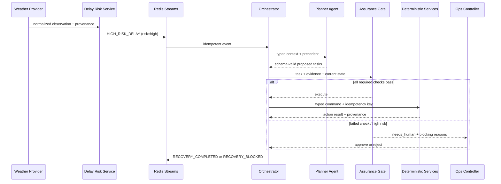

# 2. End-to-End Disruption Flow

A worked fixture: adverse weather at Bengaluru affects a scheduled network. Every headline number is
computed from seeded records, and every external source carries provenance.

## 1 — Signal

The weather provider returns a current observation or the same-shape committed fixture:

```json
{
  "airport_icao": "VOBL",
  "wind_speed_kt": 24,
  "visibility_m": 800,
  "observed_at": "2026-08-20T09:00:00Z",
  "provenance": "fixture",
  "source_ref": "fixture:bengaluru_storm:weather"
}
```

No AI. Units are normalized before rules run.

## 2 — Delay Risk service

The deterministic service evaluates wind, crosswind component, visibility, ceiling, precipitation and
configured operational thresholds. It returns an **index and band**, not an uncalibrated probability:

```json
{
  "risk_index": 87,
  "risk_level": "high",
  "factors": ["visibility_below_threshold", "crosswind_elevated"],
  "rule_version": "delay-risk-v1",
  "evidence_refs": ["fixture:bengaluru_storm:weather", "runway:VOBL:09L"]
}
```

Crossing the configured threshold emits one idempotent `HIGH_RISK_DELAY` event.

## 3 — Orchestrator opens the incident

The orchestrator deduplicates by flight/incident state, loads impacted itinerary, connection, hotel and
crew-pairing records, and writes the first decision-log entries.

Phase 1 selects one child flight. Phase 2 expands the same incident group to the 8-flight cascade; these
are not competing scenarios.

## 4 — Plan

In `LLM_MODE=live` or `fixture`, the Planner receives typed context and SQL-retrieved precedent. In
`off`, the deterministic playbook creates the minimum plan.

```json
{
  "tasks": [
    {"action": "check_connections", "depends_on": []},
    {"action": "find_hotel_options", "depends_on": []},
    {"action": "prepare_notifications", "depends_on": ["check_connections"]}
  ],
  "reason": "Protect time-sensitive connections before allocating remaining resources",
  "evidence_refs": ["incident:INC-...", "precedent:INC-..."]
}
```

Unknown action types or entity IDs are rejected before assurance.

## 5 — Assurance

Each task is proposed to the Decision Assurance Gate. The six checks return `PASS`, `WARN` or `FAIL`.
High-risk or failed actions are blocked for operator approval; no model score participates.

```json
{
  "decision": "execute",
  "risk_tier": "medium",
  "checks": {
    "evidence_complete": "PASS",
    "sources_fresh": "PASS",
    "entities_valid": "PASS",
    "policy_compliant": "PASS",
    "no_conflicts": "PASS",
    "action_risk": "PASS"
  },
  "config_version": "assurance-v1"
}
```

## 6 — Deterministic services and providers

- Connection service computes missed-connection risk from itinerary times.
- Hotel and Transport services query synthetic capacity and make simulated reservations.
- Crew Impact service walks pairing legs and identifies downstream/positioning impact; it does not
  validate duty-time legality.
- Communication service renders approved templates and sends only to allowlisted SMTP recipients;
  remaining records are simulated.
- Compensation service returns a legally authoritative result only with a verified, applicable policy
  pack. Otherwise it blocks or labels the demo fixture.

## 7 — Record, explain, report

Every event, proposal, assurance result, approval and action is immutable and timestamped. The
Explainer and Report Generator read those records; they cannot alter them.



## Communication rule

Components exchange typed events/commands through the orchestrator and event bus. Reasoning agents do
not call services directly and services never call the LLM. Adding a provider means implementing an
interface, not rewriting a reasoning prompt.
