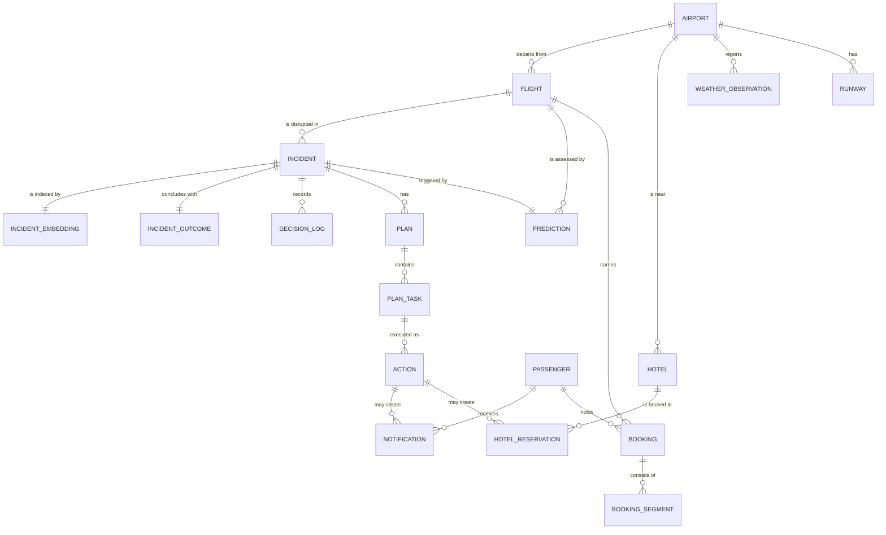

# 11. Data Model

Resolves backlog item #3. Postgres with `pgvector`, per [`10-data-sources.md`](10-data-sources.md).

Tables are grouped by origin, because that determines who owns the data and whether it is ever
written to at runtime.

| Group | Origin | Runtime writes |
| --- | --- | --- |
| Reference | Loaded from public datasets | Never |
| Operational | Seeded real schedules + simulator | Yes |
| Synthetic | Generated | Seeded once, then yes |
| Decision record | Produced by the system | Yes — append-only |
| Policy | Hand-authored config | Never at runtime |

## Entity relationships



---

## Reference tables

Loaded from [OurAirports](https://ourairports.com/data) (public domain). Read-only at runtime.

```sql
CREATE TABLE airport (
    icao_code       CHAR(4) PRIMARY KEY,          -- VOBL
    iata_code       CHAR(3) UNIQUE,               -- BLR
    name            TEXT        NOT NULL,
    city            TEXT,
    country_code    CHAR(2)     NOT NULL,
    latitude        NUMERIC(9,6) NOT NULL,
    longitude       NUMERIC(9,6) NOT NULL,
    elevation_ft    INTEGER,
    timezone        TEXT        NOT NULL
);

CREATE TABLE runway (
    id              BIGSERIAL PRIMARY KEY,
    airport_icao    CHAR(4) REFERENCES airport(icao_code),
    designator      TEXT    NOT NULL,             -- "09L"
    heading_deg     NUMERIC(4,1),                 -- needed for crosswind
    length_ft       INTEGER,
    surface         TEXT,
    is_closed       BOOLEAN DEFAULT FALSE
);
```

`runway.heading_deg` exists for a specific reason: crosswind is a function of wind direction *relative
to runway orientation*. A rule using raw wind speed alone will flag a 45 kt headwind as dangerous when
it is operationally fine.

## Weather

One row per METAR observation. Append-only; this is the prediction feature source.

```sql
CREATE TABLE weather_observation (
    id                  BIGSERIAL PRIMARY KEY,
    airport_icao        CHAR(4) REFERENCES airport(icao_code),
    observed_at         TIMESTAMPTZ NOT NULL,
    source              TEXT NOT NULL,            -- 'metar' | 'taf' | 'open-meteo'
    is_forecast         BOOLEAN NOT NULL DEFAULT FALSE,
    wind_speed_kt       NUMERIC(5,1),
    wind_gust_kt        NUMERIC(5,1),
    wind_direction_deg  NUMERIC(4,1),
    visibility_m        INTEGER,
    ceiling_ft          INTEGER,
    temperature_c       NUMERIC(4,1),
    dewpoint_c          NUMERIC(4,1),
    precipitation       TEXT,
    raw_text            TEXT,                     -- original METAR string
    UNIQUE (airport_icao, observed_at, source, is_forecast)
);
```

Two deliberate choices:

- **`raw_text` is retained.** When a parser bug produces a nonsensical prediction, the original string
  is the only way to tell whether the data or the parse was wrong.
- **`is_forecast` distinguishes TAF from METAR.** Training a model on forecasts as though they were
  observations is a subtle and very common leakage bug.

## Operational tables

Schedules seeded from the [AIKosh flight schedule dataset](https://aikosh.indiaai.gov.in/home/datasets/details/flight_schedule.html);
status driven by the local simulator.

```sql
CREATE TABLE flight (
    id                      BIGSERIAL PRIMARY KEY,
    flight_number           TEXT NOT NULL,        -- 'AI203'
    airline_code            CHAR(2) NOT NULL,
    origin_icao             CHAR(4) REFERENCES airport(icao_code),
    destination_icao        CHAR(4) REFERENCES airport(icao_code),
    scheduled_departure     TIMESTAMPTZ NOT NULL,
    scheduled_arrival       TIMESTAMPTZ NOT NULL,
    estimated_departure     TIMESTAMPTZ,
    estimated_arrival       TIMESTAMPTZ,
    status                  TEXT NOT NULL DEFAULT 'scheduled',
    delay_minutes           INTEGER NOT NULL DEFAULT 0,
    aircraft_type           TEXT,
    seat_capacity           INTEGER,
    gate                    TEXT,
    UNIQUE (flight_number, scheduled_departure)
);
-- status: scheduled | boarding | departed | arrived | delayed | cancelled | diverted
```

`flight` is the single source of truth for flight state — the answer to risk #7 in
[`07-risks-and-mitigations.md`](07-risks-and-mitigations.md). Only the simulator and the Gate Agent
write to it, and each writes to distinct columns.

## Synthetic tables

Necessarily generated — no free source exists. See [`12-synthetic-data-plan.md`](12-synthetic-data-plan.md).

```sql
CREATE TABLE passenger (
    id                  BIGSERIAL PRIMARY KEY,
    reference           TEXT UNIQUE NOT NULL,     -- 'PAX-00001'
    full_name           TEXT NOT NULL,            -- synthetic
    email               TEXT,                     -- synthetic or test inbox
    phone               TEXT,                     -- synthetic, never dialled
    tier                TEXT DEFAULT 'standard',  -- standard | silver | gold | platinum
    has_special_needs   BOOLEAN DEFAULT FALSE,
    preferred_language  TEXT DEFAULT 'en'
);

CREATE TABLE booking (
    id                  BIGSERIAL PRIMARY KEY,
    reference           TEXT UNIQUE NOT NULL,     -- PNR
    passenger_id        BIGINT REFERENCES passenger(id),
    created_at          TIMESTAMPTZ NOT NULL DEFAULT now()
);

CREATE TABLE booking_segment (
    id                  BIGSERIAL PRIMARY KEY,
    booking_id          BIGINT REFERENCES booking(id),
    flight_id           BIGINT REFERENCES flight(id),
    segment_order       SMALLINT NOT NULL,
    cabin               TEXT DEFAULT 'economy',
    UNIQUE (booking_id, segment_order)
);

CREATE TABLE hotel (
    id                  BIGSERIAL PRIMARY KEY,
    name                TEXT NOT NULL,
    airport_icao        CHAR(4) REFERENCES airport(icao_code),
    distance_km         NUMERIC(5,2) NOT NULL,
    rate_inr            INTEGER NOT NULL,
    total_rooms         INTEGER NOT NULL,
    is_partner          BOOLEAN NOT NULL DEFAULT FALSE,
    star_rating         SMALLINT
);
```

`booking_segment` is what makes connections tractable. "47 connections at risk" is a query: passengers
whose next segment departs before their delayed segment now arrives.

`hotel.is_partner` and `rate_inr` exist to make the Hotel Agent's constraints from
[`03-agent-design.md`](03-agent-design.md) enforceable in SQL — budget under ₹6000, partner hotels
first — rather than hoping the model respects them.

## Decision record tables

Append-only. This group *is* the explainability answer to risk #8, and the memory substrate from
[`05-memory-and-rag.md`](05-memory-and-rag.md).

```sql
CREATE TABLE prediction (
    id                  BIGSERIAL PRIMARY KEY,
    flight_id           BIGINT REFERENCES flight(id),
    airport_icao        CHAR(4) REFERENCES airport(icao_code),
    predicted_at        TIMESTAMPTZ NOT NULL DEFAULT now(),
    delay_probability   NUMERIC(4,3) NOT NULL,    -- 0.870
    model_version       TEXT NOT NULL,            -- 'rules-v1'
    features            JSONB NOT NULL            -- exact inputs used
);

CREATE TABLE incident (
    id                  BIGSERIAL PRIMARY KEY,
    reference           TEXT UNIQUE NOT NULL,     -- 'INC-2026-0807-VOBL-01'
    flight_id           BIGINT REFERENCES flight(id),
    prediction_id       BIGINT REFERENCES prediction(id),
    trigger_type        TEXT NOT NULL,            -- weather | technical | crew | atc
    severity            TEXT NOT NULL,            -- low | medium | high | critical
    status              TEXT NOT NULL DEFAULT 'open',
    opened_at           TIMESTAMPTZ NOT NULL DEFAULT now(),
    closed_at           TIMESTAMPTZ
);
-- status: open | planning | awaiting_approval | executing | resolved | failed

CREATE UNIQUE INDEX one_open_incident_per_flight
    ON incident (flight_id) WHERE status <> 'resolved' AND status <> 'failed';
```

That partial unique index is FR-6 enforced in the database rather than in application code — a weather
poll every 60 seconds cannot open 60 incidents an hour.

```sql
CREATE TABLE plan (
    id                  BIGSERIAL PRIMARY KEY,
    incident_id         BIGINT REFERENCES incident(id),
    generated_at        TIMESTAMPTZ NOT NULL DEFAULT now(),
    generator           TEXT NOT NULL,            -- 'groq:llama-3.3-70b' | 'fallback-playbook'
    prompt_version      TEXT,
    confidence          SMALLINT,
    rationale           TEXT,                     -- the 'why', for FR-22
    raw_response        JSONB,
    retrieved_incidents BIGINT[],                 -- precedent actually shown to the planner
    approved_by         TEXT,
    approved_at         TIMESTAMPTZ
);

CREATE TABLE plan_task (
    id                  BIGSERIAL PRIMARY KEY,
    plan_id             BIGINT REFERENCES plan(id),
    task_type           TEXT NOT NULL,            -- notify_passengers | reserve_hotels | ...
    task_order          SMALLINT NOT NULL,
    depends_on          BIGINT[],                 -- enables parallel execution, FR-18
    status              TEXT NOT NULL DEFAULT 'pending'
);

CREATE TABLE action (
    id                  BIGSERIAL PRIMARY KEY,
    plan_task_id        BIGINT REFERENCES plan_task(id),
    agent               TEXT NOT NULL,            -- 'hotel_agent'
    idempotency_key     TEXT UNIQUE NOT NULL,     -- FR-19
    status              TEXT NOT NULL,            -- success | failure | skipped | needs_human
    confidence          SMALLINT,
    reason              TEXT NOT NULL,
    cost_inr            INTEGER,
    payload             JSONB,
    executed_at         TIMESTAMPTZ NOT NULL DEFAULT now()
);
```

`action` mirrors the agent response contract from [`03-agent-design.md`](03-agent-design.md) exactly —
`status`, `confidence`, `reason`. The contract and the table are the same shape on purpose: persisting
an agent response requires no translation, so nothing is lost before it reaches the audit trail.

`plan.retrieved_incidents` records which precedent the planner was *actually shown*. Without it, you
cannot later distinguish a bad plan from a good plan given bad context.

```sql
CREATE TABLE hotel_reservation (
    id                  BIGSERIAL PRIMARY KEY,
    action_id           BIGINT REFERENCES action(id),
    hotel_id            BIGINT REFERENCES hotel(id),
    booking_id          BIGINT REFERENCES booking(id),
    rooms               SMALLINT NOT NULL DEFAULT 1,
    nights              SMALLINT NOT NULL DEFAULT 1,
    rate_inr            INTEGER NOT NULL,
    is_simulated        BOOLEAN NOT NULL DEFAULT TRUE
);

CREATE TABLE notification (
    id                  BIGSERIAL PRIMARY KEY,
    action_id           BIGINT REFERENCES action(id),
    passenger_id        BIGINT REFERENCES passenger(id),
    channel             TEXT NOT NULL,            -- email | sms | push
    delivery_mode       TEXT NOT NULL,            -- real | simulated
    subject             TEXT,
    body                TEXT NOT NULL,
    provider_message_id TEXT,
    status              TEXT NOT NULL,            -- queued | sent | failed
    sent_at             TIMESTAMPTZ
);

CREATE TABLE decision_log (
    id                  BIGSERIAL PRIMARY KEY,
    incident_id         BIGINT REFERENCES incident(id),
    occurred_at         TIMESTAMPTZ NOT NULL DEFAULT now(),
    stage               TEXT NOT NULL,            -- ingest | predict | plan | validate | execute
    actor               TEXT NOT NULL,
    event_type          TEXT NOT NULL,
    summary             TEXT NOT NULL,
    detail              JSONB
);
```

`notification.delivery_mode` is what keeps the demo honest. Three real emails and 177 simulated ones is
fine — silently implying all 180 were delivered is not.

`decision_log` powers both FR-23 and the replay engine (FR-28). Replay is then a read over this table
rather than a separate subsystem.

## Outcome and retrieval

```sql
CREATE TABLE incident_outcome (
    incident_id             BIGINT PRIMARY KEY REFERENCES incident(id),
    resolved                BOOLEAN NOT NULL,
    passengers_affected     INTEGER,
    passengers_reaccommodated INTEGER,
    connections_protected   INTEGER,
    total_cost_inr          INTEGER,
    resolution_minutes      INTEGER,
    operator_rating         SMALLINT,             -- 1-5, FR-21
    operator_notes          TEXT
);

CREATE TABLE incident_embedding (
    incident_id     BIGINT PRIMARY KEY REFERENCES incident(id),
    summary_text    TEXT NOT NULL,                -- what gets embedded
    embedding       VECTOR(384),
    indexed_at      TIMESTAMPTZ NOT NULL DEFAULT now()
);

CREATE INDEX ON incident_embedding
    USING hnsw (embedding vector_cosine_ops);
```

`incident_outcome` closes the learning loop. Retrieval must prefer incidents where `resolved = true`
and cost was low — otherwise the planner learns from failures as readily as successes, which is worse
than having no memory at all.

`summary_text` is stored alongside the vector deliberately: embeddings are opaque, and when retrieval
returns something irrelevant you need to see what was actually indexed.

⚠️ **`VECTOR(384)` assumes a 384-dimension embedding model** (e.g. a MiniLM-class sentence
transformer, runnable locally at no cost). Groq does not currently serve embeddings, so embedding
generation needs its own decision — flagged in [`OPEN-QUESTIONS.md`](OPEN-QUESTIONS.md).

## Policy tables

Hand-authored configuration. This is where the deterministic half of
[`06-ai-vs-deterministic.md`](06-ai-vs-deterministic.md) lives.

```sql
CREATE TABLE compensation_rule (
    id                  BIGSERIAL PRIMARY KEY,
    min_delay_minutes   INTEGER NOT NULL,
    max_delay_minutes   INTEGER,
    cabin               TEXT,
    passenger_tier      TEXT,
    amount_inr          INTEGER NOT NULL,
    includes_hotel      BOOLEAN NOT NULL DEFAULT FALSE,
    includes_meal       BOOLEAN NOT NULL DEFAULT FALSE,
    regulation_ref      TEXT,                     -- DGCA CAR citation
    effective_from      DATE NOT NULL
);

CREATE TABLE policy_constraint (
    id              BIGSERIAL PRIMARY KEY,
    agent           TEXT NOT NULL,                -- 'hotel_agent'
    constraint_key  TEXT NOT NULL,                -- 'max_rate_inr'
    constraint_value JSONB NOT NULL,              -- 6000
    is_hard         BOOLEAN NOT NULL DEFAULT TRUE,
    description     TEXT
);
```

`compensation_rule.regulation_ref` is what makes FR-16 defensible. When a judge asks why compensation
is ₹4,200, the answer cites a DGCA Civil Aviation Requirement, not a model.

`policy_constraint` externalises agent constraints into data, so the validation layer in
[`03-agent-design.md`](03-agent-design.md) reads limits from one place instead of hardcoding ₹6000
across the codebase.

⚠️ **Actual DGCA compensation figures are not filled in.** Real values need sourcing from the relevant
CAR before the table means anything.

## Indexes worth having early

```sql
CREATE INDEX ON weather_observation (airport_icao, observed_at DESC);
CREATE INDEX ON flight (origin_icao, scheduled_departure);
CREATE INDEX ON flight (status) WHERE status IN ('delayed','cancelled');
CREATE INDEX ON booking_segment (flight_id);
CREATE INDEX ON decision_log (incident_id, occurred_at);
CREATE INDEX ON action (plan_task_id);
```

The `booking_segment (flight_id)` index is the one that matters for the demo — it backs the
connection-risk query, which runs against every passenger on a disrupted flight.

## Deliberately absent

| Not modelled | Why |
| --- | --- |
| Crew, rosters, duty limits | Out of scope; a hard regulated domain |
| Payments, refunds, ledgers | No real money moves |
| Aircraft maintenance | Not needed for weather disruption |
| Baggage | Out of scope |
| Multi-airline interlining | Out of scope |
| Users, roles, auth | Backlog #19, undesigned |
