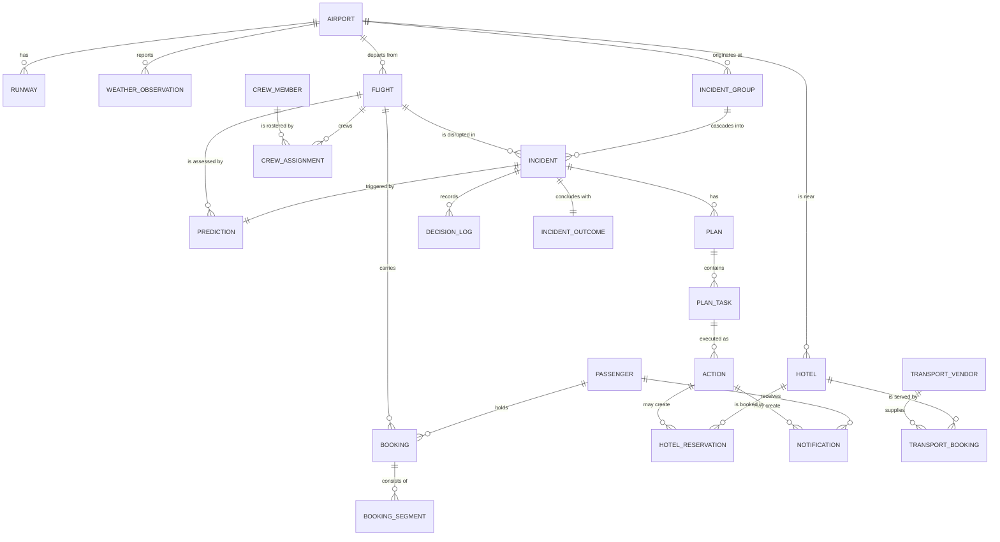

# 11. Data Model

Resolves backlog item #3. Plain Postgres — **no vector extension for the MVP**, per D2 in
[`DECISIONS.md`](DECISIONS.md).

Tables are grouped by origin, because that determines who owns the data and whether it is ever
written to at runtime.

| Group | Origin | Runtime writes |
| --- | --- | --- |
| Reference | Loaded from public datasets | Never |
| Operational | Validated public schedule snapshot **or labelled synthetic fallback**, plus simulator | Yes |
| Synthetic | Generated | Seeded once, then yes |
| Decision record | Produced by the system | Yes — append-only |
| Policy | Hand-authored config | Never at runtime |

## Entity relationships



---

## Reference tables

Loaded from [OurAirports](https://ourairports.com/data) (public domain). Read-only at runtime.

```sql
CREATE TABLE airport (
    icao_code       CHAR(4) PRIMARY KEY,          -- VOBL
    iata_code       CHAR(3) UNIQUE,               -- BLR
    name            TEXT        NOT NULL,
    city            TEXT,
    country_code    CHAR(2)     NOT NULL,
    latitude        NUMERIC(9,6) NOT NULL,
    longitude       NUMERIC(9,6) NOT NULL,
    elevation_ft    INTEGER,
    timezone        TEXT        NOT NULL
);

CREATE TABLE runway (
    id              BIGSERIAL PRIMARY KEY,
    airport_icao    CHAR(4) REFERENCES airport(icao_code),
    designator      TEXT    NOT NULL,             -- "09L"
    heading_deg     NUMERIC(4,1),                 -- needed for crosswind
    length_ft       INTEGER,
    surface         TEXT,
    is_closed       BOOLEAN DEFAULT FALSE
);
```

`runway.heading_deg` exists for a specific reason: crosswind is a function of wind direction *relative
to runway orientation*. A rule using raw wind speed alone will flag a 45 kt headwind as dangerous when
it is operationally fine.

## Weather

One row per METAR observation. Append-only; this is the prediction feature source.

```sql
CREATE TABLE weather_observation (
    id                  BIGSERIAL PRIMARY KEY,
    airport_icao        CHAR(4) REFERENCES airport(icao_code),
    observed_at         TIMESTAMPTZ NOT NULL,
    source              TEXT NOT NULL,            -- 'metar' | 'taf' | 'open-meteo'
    is_forecast         BOOLEAN NOT NULL DEFAULT FALSE,
    wind_speed_kt       NUMERIC(5,1),
    wind_gust_kt        NUMERIC(5,1),
    wind_direction_deg  NUMERIC(4,1),
    visibility_m        INTEGER,
    ceiling_ft          INTEGER,
    temperature_c       NUMERIC(4,1),
    dewpoint_c          NUMERIC(4,1),
    precipitation       TEXT,
    raw_text            TEXT,                     -- original METAR string
    UNIQUE (airport_icao, observed_at, source, is_forecast)
);
```

Two deliberate choices:

- **`raw_text` is retained.** When a parser bug produces a nonsensical prediction, the original string
  is the only way to tell whether the data or the parse was wrong.
- **`is_forecast` distinguishes TAF from METAR.** Training a model on forecasts as though they were
  observations is a subtle and very common leakage bug.

## Operational tables

Schedules seeded from the [AIKosh flight schedule dataset](https://aikosh.indiaai.gov.in/home/datasets/details/flight_schedule.html);
status driven by the local simulator.

```sql
CREATE TABLE flight (
    id                      BIGSERIAL PRIMARY KEY,
    flight_number           TEXT NOT NULL,        -- 'AI203'
    airline_code            CHAR(2) NOT NULL,
    origin_icao             CHAR(4) REFERENCES airport(icao_code),
    destination_icao        CHAR(4) REFERENCES airport(icao_code),
    scheduled_departure     TIMESTAMPTZ NOT NULL,
    scheduled_arrival       TIMESTAMPTZ NOT NULL,
    estimated_departure     TIMESTAMPTZ,
    estimated_arrival       TIMESTAMPTZ,
    status                  TEXT NOT NULL DEFAULT 'scheduled',
    delay_minutes           INTEGER NOT NULL DEFAULT 0,
    aircraft_type           TEXT,
    seat_capacity           INTEGER,
    gate                    TEXT,
    UNIQUE (flight_number, scheduled_departure)
);
-- status: scheduled | boarding | departed | arrived | delayed | cancelled | diverted
```

`flight` is the single source of truth for flight state — the answer to risk #7 in
[`07-risks-and-mitigations.md`](07-risks-and-mitigations.md). Only the simulator and the Gate Agent
write to it, and each writes to distinct columns.

## Synthetic tables

Generated for the prototype because production inventory/PII is outside scope and no suitable source
has been validated under current constraints. See [`12-synthetic-data-plan.md`](12-synthetic-data-plan.md).

```sql
CREATE TABLE passenger (
    id                  BIGSERIAL PRIMARY KEY,
    reference           TEXT UNIQUE NOT NULL,     -- 'PAX-00001'
    full_name           TEXT NOT NULL,            -- synthetic
    email               TEXT,                     -- synthetic or test inbox
    phone               TEXT,                     -- synthetic, never dialled
    tier                TEXT DEFAULT 'standard',  -- standard | silver | gold | platinum
    has_special_needs   BOOLEAN DEFAULT FALSE,
    preferred_language  TEXT DEFAULT 'en'
);

CREATE TABLE booking (
    id                  BIGSERIAL PRIMARY KEY,
    reference           TEXT UNIQUE NOT NULL,     -- PNR
    passenger_id        BIGINT REFERENCES passenger(id),
    created_at          TIMESTAMPTZ NOT NULL DEFAULT now()
);

CREATE TABLE booking_segment (
    id                  BIGSERIAL PRIMARY KEY,
    booking_id          BIGINT REFERENCES booking(id),
    flight_id           BIGINT REFERENCES flight(id),
    segment_order       SMALLINT NOT NULL,
    cabin               TEXT DEFAULT 'economy',
    UNIQUE (booking_id, segment_order)
);

CREATE TABLE hotel (
    id                  BIGSERIAL PRIMARY KEY,
    name                TEXT NOT NULL,
    airport_icao        CHAR(4) REFERENCES airport(icao_code),
    distance_km         NUMERIC(5,2) NOT NULL,
    rate_inr            INTEGER NOT NULL,
    total_rooms         INTEGER NOT NULL,
    is_partner          BOOLEAN NOT NULL DEFAULT FALSE,
    star_rating         SMALLINT
);
```

`booking_segment` is what makes connections tractable. "47 connections at risk" is a query: passengers
whose next segment departs before their delayed segment now arrives.

`hotel.is_partner` and `rate_inr` exist to make the Hotel service's constraints from
[`03-agent-design.md`](03-agent-design.md) enforceable in SQL—budget under the configured cap and
partner preference—rather than hoping a model respects them.

## Decision record tables

Append-only. This group *is* the explainability answer to risk #8, and the memory substrate from
[`05-memory-and-rag.md`](05-memory-and-rag.md).

```sql
CREATE TABLE prediction (
    id                  BIGSERIAL PRIMARY KEY,
    flight_id           BIGINT REFERENCES flight(id),
    airport_icao        CHAR(4) REFERENCES airport(icao_code),
    predicted_at        TIMESTAMPTZ NOT NULL DEFAULT now(),
    risk_index          SMALLINT NOT NULL CHECK (risk_index BETWEEN 0 AND 100),
    risk_level          TEXT NOT NULL,            -- low | elevated | high | severe
    rule_version        TEXT NOT NULL,            -- 'delay-risk-v1'
    factors             JSONB NOT NULL,           -- named contributing factors
    evidence_refs       JSONB NOT NULL            -- exact source/entity references
);

CREATE TABLE incident (
    id                  BIGSERIAL PRIMARY KEY,
    reference           TEXT UNIQUE NOT NULL,     -- 'INC-2026-0807-VOBL-01'
    flight_id           BIGINT REFERENCES flight(id),
    prediction_id       BIGINT REFERENCES prediction(id),
    trigger_type        TEXT NOT NULL,            -- weather | technical | crew | atc
    severity            TEXT NOT NULL,            -- low | medium | high | critical
    status              TEXT NOT NULL DEFAULT 'detected'
                        CHECK (status IN (
                            'detected','assessing','planning','assuring',
                            'awaiting_approval','executing','resolved','blocked','failed'
                        )),
    opened_at           TIMESTAMPTZ NOT NULL DEFAULT now(),
    closed_at           TIMESTAMPTZ
);

CREATE UNIQUE INDEX one_active_incident_per_flight
    ON incident (flight_id)
    WHERE status NOT IN ('resolved', 'blocked', 'failed');
```

That partial unique index is FR-6 enforced in the database rather than in application code—a weather
poll every 60 seconds cannot open 60 active incidents an hour. `awaiting_approval` remains active and
resumes the same incident after a new immutable decision; `blocked` is terminal and permits a later new
incident only after the blocked workflow is explicitly closed.

```sql
CREATE TABLE plan (
    id                  BIGSERIAL PRIMARY KEY,
    incident_id         BIGINT REFERENCES incident(id),
    generated_at        TIMESTAMPTZ NOT NULL DEFAULT now(),
    generator           TEXT NOT NULL,            -- 'groq:llama-3.3-70b' | 'fallback-playbook'
    prompt_version      TEXT,
    model_self_report   SMALLINT,                 -- diagnostic only; NEVER an execution gate
    rationale           TEXT,
    raw_response        JSONB,
    retrieved_incidents BIGINT[]
);

CREATE TABLE plan_task (
    id                  BIGSERIAL PRIMARY KEY,
    plan_id             BIGINT REFERENCES plan(id),
    task_type           TEXT NOT NULL,            -- notify_passengers | reserve_hotels | ...
    task_order          SMALLINT NOT NULL,
    depends_on          BIGINT[],                 -- enables parallel execution, FR-18
    status              TEXT NOT NULL DEFAULT 'pending'
);

CREATE TABLE assurance_evaluation (
    id                  BIGSERIAL PRIMARY KEY,
    plan_task_id        BIGINT NOT NULL REFERENCES plan_task(id),
    decision            TEXT NOT NULL,             -- execute | execute_flagged | needs_human
    risk_tier           TEXT NOT NULL,             -- low | medium | high
    check_results       JSONB NOT NULL,            -- six PASS/WARN/FAIL records + reasons
    blocking_reasons    JSONB NOT NULL DEFAULT '[]',
    evidence_refs       JSONB NOT NULL DEFAULT '[]',
    config_version      TEXT NOT NULL,
    config_hash         TEXT NOT NULL,
    evaluated_at        TIMESTAMPTZ NOT NULL DEFAULT now()
);

CREATE TABLE human_decision (
    id                  BIGSERIAL PRIMARY KEY,
    assurance_id        BIGINT NOT NULL UNIQUE REFERENCES assurance_evaluation(id),
    decision            TEXT NOT NULL CHECK (decision IN ('approved', 'rejected')),
    actor_id            TEXT NOT NULL,             -- pseudonymous demo operator ID
    reason              TEXT NOT NULL,
    decided_at          TIMESTAMPTZ NOT NULL DEFAULT now()
);

CREATE TABLE action (
    id                  BIGSERIAL PRIMARY KEY,
    plan_task_id        BIGINT NOT NULL REFERENCES plan_task(id),
    assurance_id        BIGINT NOT NULL REFERENCES assurance_evaluation(id),
    human_decision_id   BIGINT REFERENCES human_decision(id),
    actor               TEXT NOT NULL,             -- 'hotel_service' | 'orchestrator'
    idempotency_key     TEXT UNIQUE NOT NULL,
    status              TEXT NOT NULL,             -- success | failure | skipped | needs_human
    reason              TEXT NOT NULL,
    cost_inr            INTEGER,
    payload             JSONB,
    executed_at         TIMESTAMPTZ
);
```

`plan.model_self_report` stores a model-emitted number only for diagnostic comparison; it never affects
control flow. `assurance_evaluation` is the immutable gate record. `human_decision` is append-only and
unique per blocked evaluation; correcting a decision requires a new evaluation rather than mutating
history. An action references the exact assurance record, and when that record required a human it must
also reference an `approved` decision for the same evaluation. This cross-row invariant is enforced in
the service transaction and covered by a database integration test.

`plan.retrieved_incidents` records which precedent the planner was *actually shown*. Without it, you
cannot later distinguish a bad plan from a good plan given bad context.

```sql
CREATE TABLE hotel_reservation (
    id                  BIGSERIAL PRIMARY KEY,
    action_id           BIGINT REFERENCES action(id),
    hotel_id            BIGINT REFERENCES hotel(id),
    booking_id          BIGINT REFERENCES booking(id),
    rooms               SMALLINT NOT NULL DEFAULT 1,
    nights              SMALLINT NOT NULL DEFAULT 1,
    rate_inr            INTEGER NOT NULL,
    is_simulated        BOOLEAN NOT NULL DEFAULT TRUE
);

CREATE TABLE notification (
    id                  BIGSERIAL PRIMARY KEY,
    action_id           BIGINT REFERENCES action(id),
    passenger_id        BIGINT REFERENCES passenger(id),
    channel             TEXT NOT NULL,            -- email | sms | push
    delivery_mode       TEXT NOT NULL,            -- real | simulated
    subject             TEXT,
    body                TEXT NOT NULL,
    provider_message_id TEXT,
    status              TEXT NOT NULL,            -- queued | sent | failed
    sent_at             TIMESTAMPTZ
);

CREATE TABLE decision_log (
    id                  BIGSERIAL PRIMARY KEY,
    incident_id         BIGINT REFERENCES incident(id),
    occurred_at         TIMESTAMPTZ NOT NULL DEFAULT now(),
    stage               TEXT NOT NULL,            -- ingest | predict | plan | validate | execute
    actor               TEXT NOT NULL,
    event_type          TEXT NOT NULL,
    summary             TEXT NOT NULL,
    detail              JSONB
);
```

`notification.delivery_mode` is what keeps the demo honest. Three real emails and 177 simulated ones is
fine — silently implying all 180 were delivered is not.

`decision_log` powers both FR-23 and the replay engine (FR-28). Replay is then a read over this table
rather than a separate subsystem.

## Outcome and retrieval

```sql
CREATE TABLE incident_outcome (
    incident_id             BIGINT PRIMARY KEY REFERENCES incident(id),
    resolved                BOOLEAN NOT NULL,
    passengers_affected     INTEGER,
    passengers_reaccommodated INTEGER,
    connections_protected   INTEGER,
    total_cost_inr          INTEGER,
    resolution_minutes      INTEGER,
    operator_rating         SMALLINT,             -- 1-5, FR-21
    operator_notes          TEXT
);

-- Retrieval index: structured, not vector. See D2 in DECISIONS.md
CREATE INDEX ON incident (trigger_type, severity);
CREATE INDEX ON incident_outcome (resolved, total_cost_inr);
```

`incident_outcome` closes the learning loop. Retrieval must prefer incidents where `resolved = true`
and cost was low — otherwise the planner learns from failures as readily as successes, which is worse
than having no memory at all. That is why the index above is on `(resolved, total_cost_inr)` rather
than on recency.

### Retrieval strategy: SQL, not vectors

**Decided:** no embedding table for the MVP. Precedent is retrieved by structured filtering:

```
Airport + Trigger + Severity + Weather + Flight type
        ↓
      SQL  (prefer resolved = true, low cost)
        ↓
Historical incidents → injected into the planner prompt
```

At ~150 historical incidents this retrieves better precedent than cosine similarity, and it is
explainable — you can state exactly why a past incident was surfaced, which a judge may well ask.
Injecting SQL-retrieved precedent into a prompt is still RAG; embeddings are not a prerequisite.

If embeddings are added as a stretch goal, use **BGE Small (384-dim) into Chroma** per
[`DECISIONS.md`](DECISIONS.md) — not `pgvector`. Store a `summary_text` alongside any vector, because
embeddings are opaque and you will need to see what was actually indexed when retrieval returns
something irrelevant.

## Policy tables

Hand-authored configuration. This is where the deterministic half of
[`06-ai-vs-deterministic.md`](06-ai-vs-deterministic.md) lives.

```sql
CREATE TABLE policy_pack (
    id                  BIGSERIAL PRIMARY KEY,
    pack_key            TEXT NOT NULL,             -- 'in-dgca-car-3m4'
    version             TEXT NOT NULL,
    jurisdiction        TEXT NOT NULL,
    authority           TEXT NOT NULL,
    effective_from      DATE,
    effective_to        DATE,
    currency            CHAR(3),
    review_status       TEXT NOT NULL,             -- draft | reviewed | approved | retired
    reviewed_by         TEXT,
    reviewed_at         TIMESTAMPTZ,
    pack_hash           TEXT NOT NULL,
    UNIQUE (pack_key, version)
);

CREATE TABLE policy_source_document (
    id                  BIGSERIAL PRIMARY KEY,
    policy_pack_id      BIGINT NOT NULL REFERENCES policy_pack(id),
    title               TEXT NOT NULL,
    source_url          TEXT NOT NULL,
    published_revision  TEXT,
    retrieved_at        TIMESTAMPTZ NOT NULL,
    content_hash        TEXT NOT NULL,
    licence_note        TEXT,
    local_path          TEXT NOT NULL
);

CREATE TABLE policy_clause (
    id                  BIGSERIAL PRIMARY KEY,
    source_document_id  BIGINT NOT NULL REFERENCES policy_source_document(id),
    clause_ref          TEXT NOT NULL,
    text                TEXT NOT NULL,
    extraction_method   TEXT NOT NULL,
    UNIQUE (source_document_id, clause_ref)
);

CREATE TABLE policy_rule (
    id                  BIGSERIAL PRIMARY KEY,
    policy_pack_id      BIGINT NOT NULL REFERENCES policy_pack(id),
    rule_key            TEXT NOT NULL,
    event_type          TEXT NOT NULL,
    condition_json      JSONB NOT NULL,
    entitlement_json    JSONB NOT NULL,
    source_clause_ids   BIGINT[] NOT NULL,
    review_status       TEXT NOT NULL,
    UNIQUE (policy_pack_id, rule_key)
);

CREATE TABLE policy_applicability (
    id                   BIGSERIAL PRIMARY KEY,
    incident_id          BIGINT NOT NULL REFERENCES incident(id),
    policy_pack_id       BIGINT NOT NULL REFERENCES policy_pack(id),
    status               TEXT NOT NULL CHECK (
                             status IN ('applicable', 'not_applicable', 'undetermined')
                         ),
    basis                JSONB NOT NULL,
    required_facts       JSONB NOT NULL DEFAULT '[]',
    missing_facts        JSONB NOT NULL DEFAULT '[]',
    evidence_refs        JSONB NOT NULL DEFAULT '[]',
    conflict_disposition JSONB NOT NULL DEFAULT '{}',
    resolver_version     TEXT NOT NULL,
    resolver_hash        TEXT NOT NULL,
    resolved_at          TIMESTAMPTZ NOT NULL DEFAULT now()
);

CREATE TABLE entitlement_evaluation (
    id                  BIGSERIAL PRIMARY KEY,
    incident_id         BIGINT NOT NULL REFERENCES incident(id),
    applicability_id    BIGINT NOT NULL REFERENCES policy_applicability(id),
    policy_pack_id      BIGINT NOT NULL REFERENCES policy_pack(id),
    policy_rule_id      BIGINT NOT NULL REFERENCES policy_rule(id),
    input_facts         JSONB NOT NULL,
    result              JSONB NOT NULL,
    evaluated_at        TIMESTAMPTZ NOT NULL DEFAULT now()
);

CREATE TABLE business_constraint (
    id                  BIGSERIAL PRIMARY KEY,
    service             TEXT NOT NULL,             -- 'hotel_service'
    constraint_key      TEXT NOT NULL,
    constraint_value    JSONB NOT NULL,
    is_hard             BOOLEAN NOT NULL DEFAULT TRUE,
    version             TEXT NOT NULL,
    description         TEXT
);
```

Statutory policy and internal business constraints are deliberately separate. Applicability remains
tri-state so missing facts or unresolved conflicts cannot be collapsed into a false legal conclusion.
Every entitlement is pinned to the exact pack version, reviewed rule, source clauses, applicability
record and input facts used at evaluation time. Unverified draft packs may support UI/engine development
but must not produce an authoritative legal claim.

## Indexes worth having early

```sql
CREATE INDEX ON weather_observation (airport_icao, observed_at DESC);
CREATE INDEX ON flight (origin_icao, scheduled_departure);
CREATE INDEX ON flight (status) WHERE status IN ('delayed','cancelled');
CREATE INDEX ON booking_segment (flight_id);
CREATE INDEX ON decision_log (incident_id, occurred_at);
CREATE INDEX ON action (plan_task_id);
```

The `booking_segment (flight_id)` index is the one that matters for the demo — it backs the
connection-risk query, which runs against every passenger on a disrupted flight.

> **Cascade, crew and ground transport tables are appended at the end of this document** — they were
> added after the cascading disruption decision. The deliberately-absent list there supersedes any
> earlier statement about crew being unmodelled.


---

## Cascade extension

Added for the cascading disruption scenario confirmed in [`DECISIONS.md`](DECISIONS.md). One weather
event owns many flight incidents.

```sql
CREATE TABLE incident_group (
    id                  BIGSERIAL PRIMARY KEY,
    reference           TEXT UNIQUE NOT NULL,     -- 'GRP-2026-0807-VOBL'
    root_cause          TEXT NOT NULL,            -- weather | atc | technical | crew
    airport_icao        CHAR(4) REFERENCES airport(icao_code),
    severity            TEXT NOT NULL,
    status              TEXT NOT NULL DEFAULT 'open',
    opened_at           TIMESTAMPTZ NOT NULL DEFAULT now(),
    closed_at           TIMESTAMPTZ,
    -- denormalised rollups, cheap to maintain but expensive to compute per dashboard poll
    flights_affected        INTEGER NOT NULL DEFAULT 0,
    passengers_affected     INTEGER NOT NULL DEFAULT 0,
    connections_at_risk     INTEGER NOT NULL DEFAULT 0,
    crew_rotations_affected INTEGER NOT NULL DEFAULT 0,
    total_cost_inr          INTEGER NOT NULL DEFAULT 0
);

ALTER TABLE incident
    ADD COLUMN incident_group_id BIGINT REFERENCES incident_group(id);

CREATE INDEX ON incident (incident_group_id);
```

The rollup columns exist because the ops dashboard polls frequently, and recomputing "600 passengers
affected" by joining across eight flights and fourteen thousand booking segments on every poll is
wasteful. They are maintained by the orchestrator as incidents progress.

`incident_group` is also what makes the executive report meaningful — the report is written about the
group, not about eight separate incidents.

## Crew

⚠️ **Coordination and display only. No duty-time legality validation** — explicitly out of scope, per
[`09-requirements.md`](09-requirements.md).

```sql
CREATE TABLE crew_member (
    id                  BIGSERIAL PRIMARY KEY,
    reference           TEXT UNIQUE NOT NULL,     -- 'CRW-0001'
    full_name           TEXT NOT NULL,            -- synthetic
    role                TEXT NOT NULL,            -- captain | first_officer | cabin
    base_airport_icao   CHAR(4) REFERENCES airport(icao_code),
    duty_start          TIMESTAMPTZ,
    duty_hours_used     NUMERIC(4,1) NOT NULL DEFAULT 0,
    duty_hours_limit    NUMERIC(4,1) NOT NULL DEFAULT 13.0   -- indicative flag only
);

CREATE TABLE crew_assignment (
    id                  BIGSERIAL PRIMARY KEY,
    crew_member_id      BIGINT REFERENCES crew_member(id),
    flight_id           BIGINT REFERENCES flight(id),
    status              TEXT NOT NULL DEFAULT 'assigned',
    -- assigned | reassigned | released | at_risk
    reassigned_from     BIGINT REFERENCES flight(id),
    action_id           BIGINT REFERENCES action(id),
    UNIQUE (crew_member_id, flight_id)
);
```

`duty_hours_limit` is present so the UI can flag a rotation as *at risk*, which is genuinely useful to a
controller. It is a **display flag, not a compliance decision** — the distinction must be stated in the
demo if crew comes up, because claiming legality validation you have not built is the fastest way to
lose credibility with an aviation-literate judge.

## Ground transport

```sql
CREATE TABLE transport_vendor (
    id                  BIGSERIAL PRIMARY KEY,
    name                TEXT NOT NULL,
    airport_icao        CHAR(4) REFERENCES airport(icao_code),
    vehicle_type        TEXT NOT NULL,            -- coach | taxi | shuttle
    seats_per_vehicle   SMALLINT NOT NULL,
    vehicles_available  SMALLINT NOT NULL,
    rate_per_vehicle_inr INTEGER NOT NULL,
    is_partner          BOOLEAN NOT NULL DEFAULT FALSE
);

CREATE TABLE transport_booking (
    id                  BIGSERIAL PRIMARY KEY,
    action_id           BIGINT REFERENCES action(id),
    vendor_id           BIGINT REFERENCES transport_vendor(id),
    hotel_id            BIGINT REFERENCES hotel(id),
    vehicles            SMALLINT NOT NULL,
    passengers          SMALLINT NOT NULL,
    cost_inr            INTEGER NOT NULL,
    is_simulated        BOOLEAN NOT NULL DEFAULT TRUE
);
```

Transport links `action` to a `hotel`, because ground transfer is a consequence of hotel allocation
rather than an independent decision. This also matters legally: DGCA duty of care covers hotel
accommodation **and transfers** together, per
[`13-compensation-and-policy.md`](13-compensation-and-policy.md).

If scope is cut, the Transport service can fold into the Hotel service and transfers become a cost line
rather than a separate simulated booking.

## Updated deliberately-absent list

| Not modelled | Why |
| --- | --- |
| Crew duty-time legality engine | Hard regulated domain; flags only |
| Payments, refunds, ledgers | No real money moves |
| Aircraft maintenance | Not needed for weather disruption |
| Baggage | Out of scope |
| Multi-airline interlining | Out of scope |
| Users, roles, auth | Backlog #19, still undesigned |
